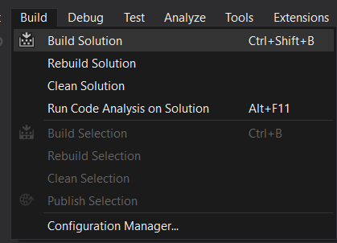

# UserInterfaceTesting.Framework.BarbaryLion  
This is a User Interface testing Framework using C#, .NET Core, xUnit, Specflow BDD test framework and Selenium WebDriver to test UltimateQA Practice site.

## Selenium WebDriver 
Selenium WebDriver is a collection of open source APIs which are used to automate the testing of a web application. Selenium WebDriver tool is used to automate web application testing to verify that it works as expected. It supports many browsers such as Firefox, Chrome, IE, and Safari. WebDriver is a web automation framework that allows you to execute your tests against different browsers. It also enables you to use a programming language in creating your test scripts. https://www.seleniumhq.org/projects/webdriver/

## Specflow  
Use SpecFlow to define, manage and automatically execute human-readable acceptance tests in .NET projects. Writing easily understandable tests is a cornerstone of the BDD paradigm and also helps build up a living documentation of your system. https://specflow.org/

## Target framework  
.NET Core 2.1

## UltimateQA Practice site 
A free place to practice some scenarios like:
* Testing a large complicated page
* Work with simple HTML elements like buttons
* Fill out forms
* Automate an application that evolves over time

https://www.ultimateqa.com/automation/

## Integrated Development Environment
Microsoft Visual Studio IDE is used to develop this Framework.

### Visual Studio Extensions
* Extensions => Manage Extensions => Search and Install SpecFlow for Visual Studio

### Build Solution
* Build => Build Solution

### Run Tests
* Test => Windows => Test Explorer => Run All

### Run Tests with Command Prompt/Windows PowerShell
* Open Folder in File Explorer: ..\UserInterfaceTesting.Framework.BarbaryLion\bin\Debug\netcoreapp2.1
* Open Command Prompt/Windows PowerShell
* Run "dotnet vstest UserInterfaceTesting.Framework.BarbaryLion.dll"
